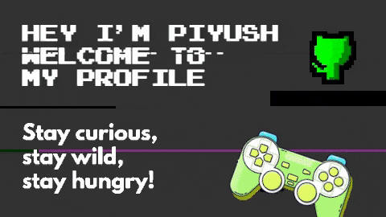
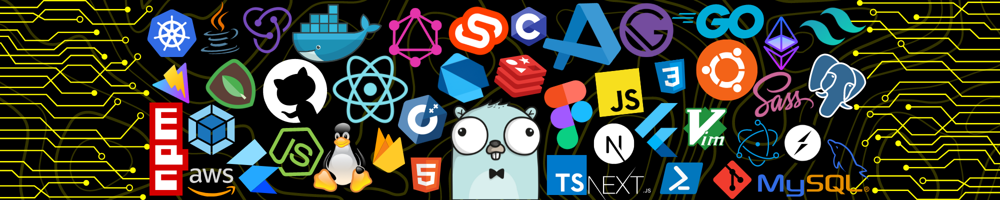
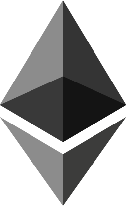
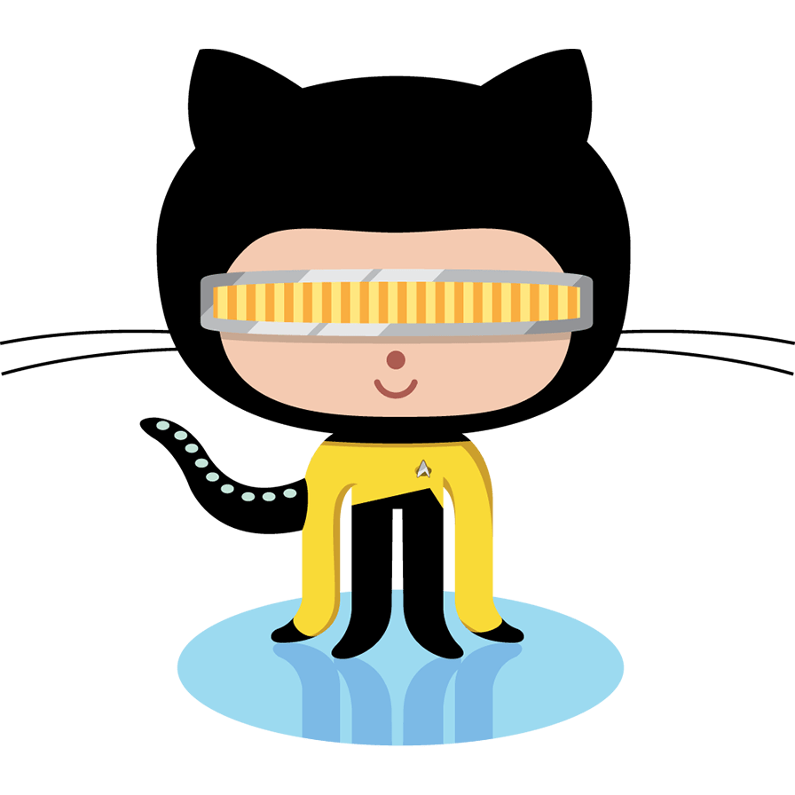

  

I'm **Piyush Pandey**, a Full Stack Developer, looking to solve real-world problems🌏. Do 🌟 my repository if you find my project interesting, at least your star could make someone's day 😄.

I love connecting with different people so if you want to say hi 💬 pandey.piyus@gmail.com, I'll be happy to have a chat with you!

Always ready to colabrate with different people and their weird ideas and stuffs.

## Connect with me [here](https://piyushpandey.tech/)

## 💼 Things that I'm currently working on:

-   Learning Backend with Go and PostgresSQL.
-   Looking forward to learn Flutter.
-   Want to learn Rust in further future.

## 🔭 Things I could do:

-   Code in C, C++, Java, Go, JavaScript, TypeScript.
-   Technologies I use React, React Native, Gatsbay, Next.js, Firebase, NodeJS.
-   My IDE Visual Studio Code.

<!-- ### Suppport my work 
[Buy Me a Coffee](https://www.buymeacoffee.com/zephyrus21)
 -->

  
  
  
  
  
  
  
  
  

 

  
  
  
  
  
  
  <!--  -->
<!--    -->
  
  
  

 

  <!--  -->

 
<!--  -->
 

<!--  -->

 
  

 
<!-- 

 -->

  

  

<!--START_SECTION:waka-->
<!--END_SECTION:waka-->
